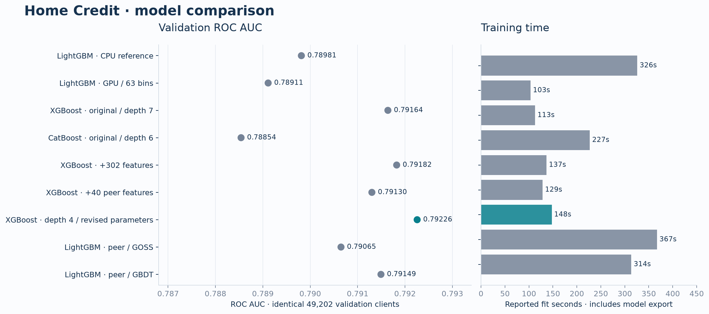

# Разбор решения Home Credit

## 1. Задача и данные

Нужно предсказать `TARGET=1` — платёжные затруднения клиента в определении
соревнования. Качество оценивается по ROC AUC. Дополнительно сохранялись
Average Precision и log loss.

В данных 307 511 размеченных заявок, из них 24 825 положительных, и 48 744
тестовых. В основной таблице находятся характеристики текущей заявки.
Остальные таблицы содержат кредитную историю: договоры, месячные остатки
и записи платежей. Размеры использованных таблиц приведены в
[table_audit.csv](../reports/metrics/table_audit.csv).

Один клиент может иметь несколько договоров и много платежей. Поэтому
дополнительные таблицы сначала приводились к уровню договора или взноса,
а затем агрегировались по клиенту. Это позволило присоединить историю
к анкете, сохранив одну строку на текущую заявку.

## 2. Подготовка данных

В датах встречается специальное значение `365243`. Оно заменялось на пропуск;
в исходной таблице признаков также сохранялись индикаторы такого значения.
Пропуски в числовых полях передавались моделям. Для отсутствующей истории
добавлялись отдельные индикаторы.

Платежи потребовали обработки на уровне взноса. Например, две выплаты
40 и 60 по обязательству на 100 должны давать погашенный взнос. Для расчёта
просрочки использовалась первая дата, когда накопленная выплата достигала
плановой суммы. Выплаты после текущей заявки не включались в наблюдённые суммы.
При неизвестной дате или сумме факт недоплаты оставлялся неопределённым.

Если записи одного взноса противоречили друг другу по сумме или сроку,
такой взнос исключался из соответствующих агрегатов. Клиент оставался
в выборке. Проверки этих случаев находятся в `tests/test_data_contracts.py`.

Массовое удаление клиентов с пропусками, обрезка доходов и SMOTE не применялись.
Наблюдаемый баланс классов сохранялся. Идентификаторы и TARGET исключались
из входных признаков моделей.

## 3. Исходные признаки и первое сравнение моделей

Первые 1250 признаков описывают текущую заявку и историю: суммы и доли долга,
просрочки, использование лимитов, частоту обращений, последние наблюдения
и изменения показателей во времени. Словарь названий находится в
[feature_dictionary.csv](../reports/metrics/feature_dictionary.csv).

Для этой таблицы сравнивались три реализации градиентного бустинга:

- **LightGBM** использовался как исходная модель; затем проверялись другие
  размеры гистограмм, число листьев и темп обучения.
- **XGBoost** проверялся с ограничением глубины деревьев и регуляризацией
  весов листьев. Эти параметры позволяли управлять сложностью модели.
- **CatBoost** обрабатывал категориальные поля как строки и использовал
  другую структуру деревьев. Его проверяли и отдельно, и в сочетании с XGBoost.

Для сравнения использовались одни и те же 49 202 клиента. Обучение
останавливалось после 150 итераций без улучшения AUC, максимум — 4000 деревьев.
Основные результаты первого этапа:

| Модель | ROC AUC | Время обучения, с |
|---|---:|---:|
| LightGBM CPU, исходные параметры | 0.789813 | 326.1 |
| LightGBM GPU, 63 bins | 0.789112 | 103.5 |
| LightGBM GPU, 127 bins, меньший learning rate | 0.790472 | 157.9 |
| XGBoost, depth 5 | 0.790959 | 100.2 |
| XGBoost, depth 7 | **0.791639** | 112.8 |
| CatBoost, depth 6 | 0.788540 | 227.0 |
| CatBoost, depth 8 | 0.787137 | 212.2 |

XGBoost глубины 7 дал лучший одиночный AUC. Увеличение глубины CatBoost
с 6 до 8 в этом сравнении не помогло. Среди вариантов LightGBM лучшим
оказался запуск с 127 bins и меньшим темпом обучения.

Время учитывалось при выборе объёма дальнейших экспериментов.
Конфигурации разных библиотек различались по параметрам, поэтому приведённые
времена относятся к конкретным запускам.

## 4. Дополнительные признаки

После первого сравнения были изучены опубликованные решения Home Credit.
У [João Aguiar](https://github.com/js-aguiar/home-credit-default-competition)
и [NoxMoon](https://github.com/NoxMoon/home-credit-default-risk) используются
условия прошлых кредитов, отдельные периоды истории и различные способы
агрегации. На этой основе были добавлены следующие группы.

**Условия и нагрузка по прошлым кредитам.** Отношение кредита к аннуитету,
общая плановая выплата, отношение плановой выплаты к сумме кредита,
разрыв между запланированными и наблюдёнными выплатами. Эти величины
позволяют модели учитывать срок и нагрузку наряду с размером кредита.
Разрыв выплат является приближением: по нему нельзя восстановить точный
остаток основного долга.

**Периоды 90 и 730 дней, последний договор, тип кредита.** Общая статистика
за всю историю может скрывать недавнее изменение поведения. Отдельные окна
дают модели доступ к этим различиям. Дополнительно разделялись наличные
и потребительские кредиты, карты и потребительские кредиты в бюро.

**Сравнение с похожими клиентами.** Для групп по профессии, образованию,
организации и другим полям считались медианы дохода, кредита, аннуитета
и внешних рейтингов. В модель передавались разности и отношения к этим
медианам. Статистики обучались внутри каждого train-фолда; для редкой группы
использовалась общая медиана обучающей части.

Первые две группы и дополнительные признаки анкеты дали 302 столбца.
Сравнения с похожими клиентами — ещё 40. В расширенном варианте получилось
1592 признака.

## 5. Сравнение признаков и параметров

Сначала дополнительные признаки проверялись с прежними параметрами XGBoost.
Затем был запущен вариант с меньшей глубиной и изменённой долей признаков
на дерево. На том же наборе данных проверялись LightGBM GBDT и GOSS.

| Вариант | Признаки | ROC AUC |
|---|---:|---:|
| XGBoost depth 7, исходный | 1250 | 0.791639 |
| XGBoost depth 7, +302 признака | 1552 | 0.791824 |
| XGBoost depth 7, ещё +40 сравнений с группой | 1592 | 0.791301 |
| XGBoost depth 4, изменённые параметры | 1592 | **0.792257** |
| LightGBM GBDT | 1592 | 0.791493 |
| LightGBM GOSS | 1592 | 0.790649 |

При прежних параметрах 302 новых признака дали прирост всего 0.000185.
Добавление групповых сравнений к depth 7 результат ухудшило. Лучшим оказался
XGBoost глубины 4 на всех признаках.

Его параметры отличались от исходного XGBoost:

| Параметр | Исходный | Выбранный |
|---|---:|---:|
| `max_depth` | 7 | 4 |
| `colsample_bytree` | 0.85 | 0.50 |
| `min_child_weight` | 50 | 30 |
| `learning_rate` | 0.030 | 0.035 |
| `max_bin` | 128 | 256 |

Уменьшение глубины ограничивает сложность взаимодействий, а доли признаков —
число доступных полей для каждого дерева. При этом снижение `min_child_weight`
ослабляет ограничение на дочерний узел. Проверялся весь набор изменений;
отдельный вклад каждого параметра не измерялся.

Версия depth 4 на исходных 1250 признаках не запускалась. Поэтому по этому
сравнению нельзя определить, какую часть улучшения дали параметры,
а какую — дополнительные признаки.

## 6. Ансамбль и кросс-валидация

На первом этапе смесь 75% исходного XGBoost и 25% CatBoost получила
0.792511. После замены XGBoost на вариант depth 4 смесь получила 0.793073
на тех же клиентах. Эти две модели были выбраны для дальнейшей проверки.

На пяти фолдах каждый клиент из development получил прогноз модели,
которая не обучалась на его строке. Такие прогнозы называют out-of-fold,
или OOF. По ним сравнивались одиночные модели и смеси с весами 25/75,
50/50 и 75/25.

| Прогноз | OOF ROC AUC |
|---|---:|
| XGBoost | 0.797366 |
| CatBoost | 0.793976 |
| 50% XGBoost + 50% CatBoost | 0.797934 |
| 75% XGBoost + 25% CatBoost | **0.798207** |

Хотя CatBoost уступал отдельно, его добавление повысило AUC смеси.
Вес 25% сохранился и после перехода от первоначального сравнения к OOF.

## 7. Итоговая проверка и отправка

Для разработки использовались 246 009 клиентов. Ещё 61 502 были отложены
для итоговой оценки. Веса ансамбля фиксировались до просмотра её результата.

| Выборка | ROC AUC | Average Precision | Log loss |
|---|---:|---:|---:|
| Development OOF | 0.798207 | 0.298229 | 0.233054 |
| Отложенная выборка | 0.798087 | 0.294200 | 0.233474 |

Для отправки модели обучены на всех метках с seed 42 и 142. Для XGBoost
использовано 1500 деревьев, для CatBoost — 3284: это медианы числа деревьев
из кросс-валидации. Прогнозы усреднены по seed и объединены с весами 75/25.

Одна поздняя отправка в Kaggle дала **public 0.80088, private 0.79968**.
По результатам лидерборда параметры не менялись.

Последний запуск с экспериментами, кросс-валидацией и финальным обучением
занял 51 минуту на двух Tesla T4. Подготовка исходных признаков заняла
485 секунд, дополнительных — 103 секунды. Ранние эксперименты в эти 51 минуту
не входят.

## 8. Выводы

Лучший результат среди проверенных вариантов дал ансамбль XGBoost
на 1592 признаках и CatBoost на исходных 1250. Самостоятельный вклад
дополнительных признаков при прежних параметрах оказался мал.
Более заметное улучшение получилось после изменения параметров XGBoost
и добавления CatBoost.

Для оценки небольших различий проведён парный bootstrap: обе модели
сравнивались на одних и тех же повторно выбранных клиентах. 95% интервалы
прироста новых вариантов включают ноль. Поэтому выбранный вариант можно
назвать лучшим в выполненных запусках; устойчивость небольшого выигрыша
потребует повторных сравнений.

OOF здесь рассчитан после предварительного отбора конфигураций. Это создаёт
оптимизм оценки. Историю использования исходного holdout до восстановленных
запусков полностью проверить нельзя. Интервал AUC на итоговом holdout
составил [0.79189; 0.80442].

Следующее сравнение — исходные и дополнительные признаки при одних и тех же
параметрах depth 4 на нескольких development-разбиениях. Оно позволило бы
решить, оправдывает ли небольшой прирост усложнение подготовки данных.
